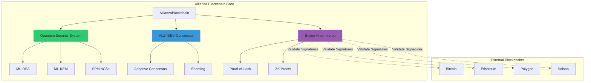
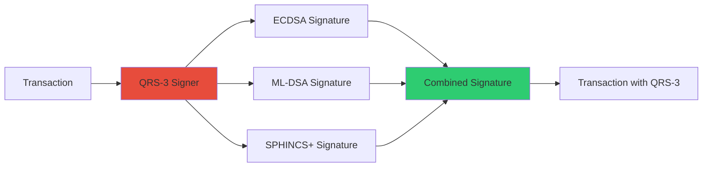
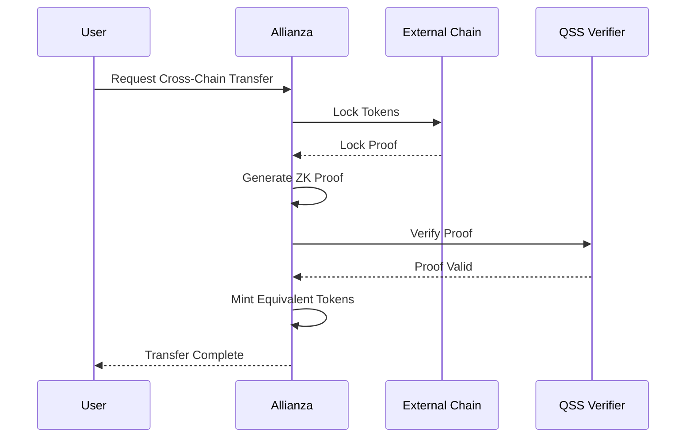
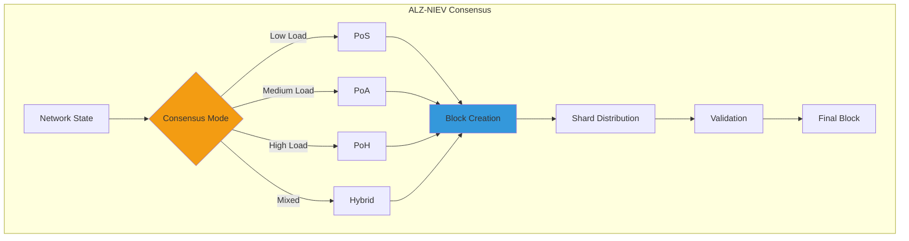
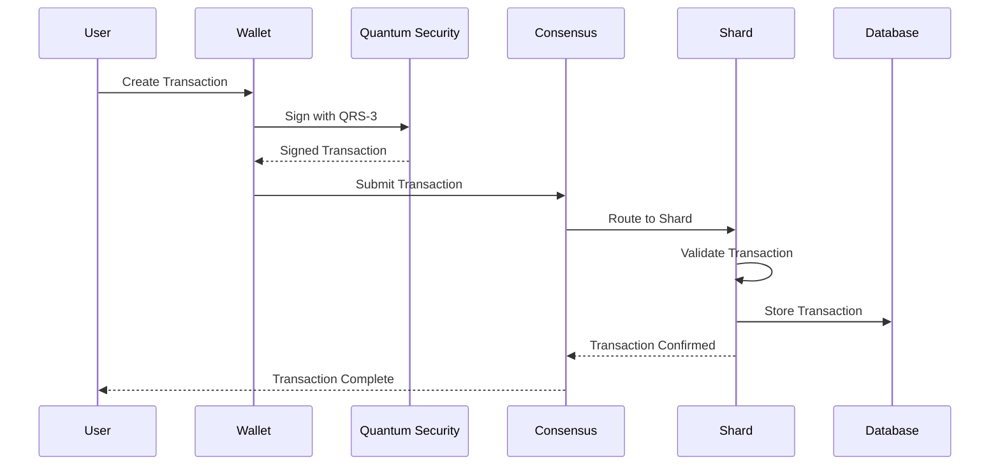
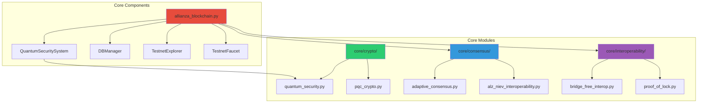
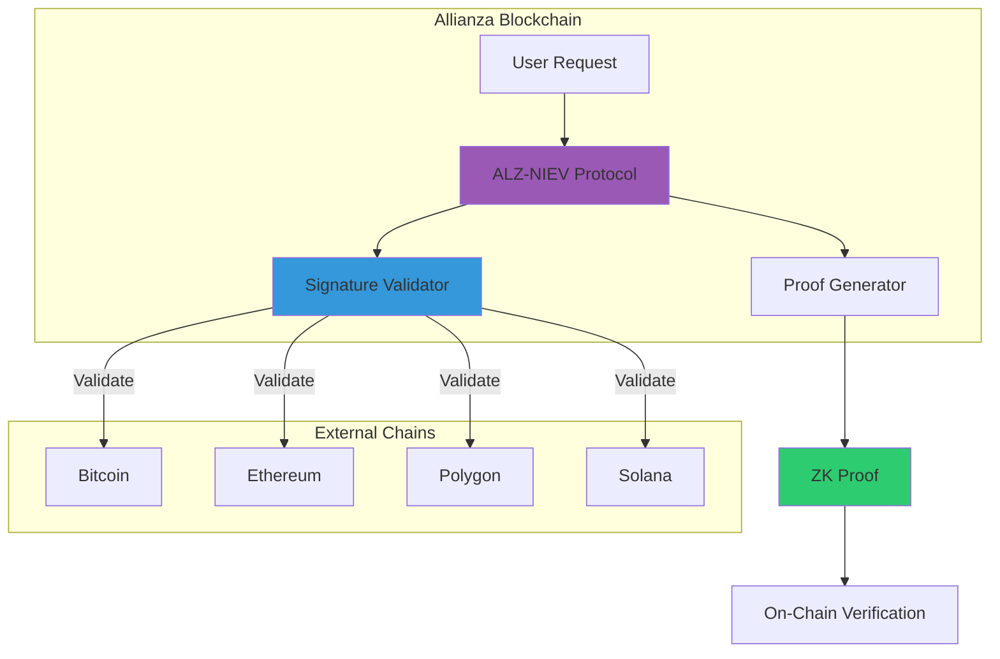
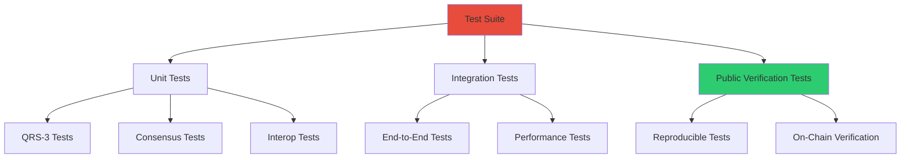

# 🏗️ Architecture Diagrams - Allianza Blockchain

## 📊 System Overview

## 🔐 QRS-3 Signature System

## 🌐 ALZ-NIEV Interoperability Flow

## 🏛️ Consensus Architecture

## 🔄 Transaction Flow

## 📦 Component Architecture

## 🔗 Interoperability Architecture

## 🧪 Test Architecture

---

**Nota:** Estes diagramas são renderizados usando Mermaid. Para visualizar:
- GitHub: Renderiza automaticamente em arquivos `.md`
- VS Code: Instale extensão "Markdown Preview Mermaid Support"
- Online: https://mermaid.live/

